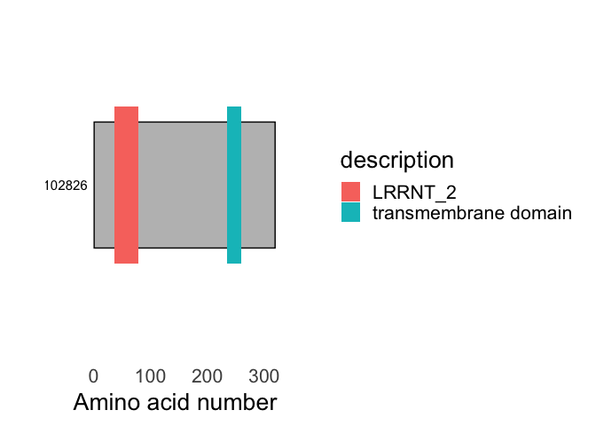

<!-- README.md is generated from README.Rmd. Please edit that file -->

# buscadoR

<!-- badges: start -->
<!-- badges: end -->

The goal of buscadoR is to find plant receptor proteins from provided
FASTA sequence. It uses the web API of Phobius, PFAMScan and a local
BLAST to find signal peptides, repeats, transmembrane and ectodomains
then applies a heuristic to classify into receptor classes.

## Installation

You can install buscadoR from [GitHub](https://github.com/) with:

``` r
# install.packages("devtools")
devtools::install_github("TeamMacLean/buscadoR")
```

## Performing the web searches

To start the searches with a new protein file you need to supply a FASTA
file of protein sequences, your valid email address and specify a
restart filename for use later.

``` r
library(buscadoR)
fasta_sequences <- "true_positive.fa"
saved_progress <- "saved_progress.RDS"
searches <- buscar(protein_file = fasta_sequences, restart_file = saved_progress, email="dan.maclean@tsl.ac.uk")
```

    restart_file saved_progress.RDS doesn't exist, interpreting this as new job with true_positive.fa as input


    Building a new DB, current time: 03/31/2022 11:14:26
    New DB name:   /var/folders/22/kjdvv_k14cj1m6hq5hl527qw8__5qg/T/RtmpACGE8i/d33a8d44877492693f49a475ebdb317d/buscador_8f593ae81e14.fa
    New DB title:  /var/folders/22/kjdvv_k14cj1m6hq5hl527qw8__5qg/T//RtmpACGE8i/d33a8d44877492693f49a475ebdb317d//buscador_8f593ae81e14.fa
    Sequence type: Protein
    Keep MBits: T
    Maximum file size: 1000000000B
    Adding sequences from FASTA; added 6 sequences in 0.00922894 seconds.

The process will run the searches. Phobius searches are really quick.
Ectodomain BLASTs are done locally. PFAMScan is more complicated so can
take a while. By default, the process will wait just one second after
submission is complete for PFAM before quitting and writing the progress
to the `restart_file` you specified.

In most cases it is expected that the searches are done in two steps. So
after having waited a while to give PFAMScan chance to run your
sequences, you can return and check the status with the same call to
`buscar()` though only the `restart_file` is needed as the parameters
are carried over from the initial job.

You’ll see a status update and a reminder to come back later if things
aren’t done yet. You can repeat this step as often as you like. Search
results can be retrieved from the PFAMScan server for up to 7 days.

``` r
searches <- buscar(restart_file = saved_progress)
```

    restart_file saved_progress.fa found, interpreting this as a restarted job with existing protein set.
    Retrieving the results for query pfamscan-R20220331-111414-0032-9483591-p1m...Done!
    Done 1 of 1 PFAMScan jobs at ebi.ac.uk

You’ll get a notice like this if things aren’t done yet

    restart_file saved_progress.fa found, interpreting this as a restarted job with existing protein set.
    Retrieving the results for query pfamscan-R20220331-111414-0032-9483591-p1m...Retrieving the query id pfamscan-R20220331-111414-0032-9483591-p1m did not worked: <?xml version="1.0" encoding="UTF-8"?>
    <error>
      <description>Job 'pfamscan-R20220331-111414-0032-9483591-p1m' is still running</description>
    </error>

    Done 0 of 1 PFAMScan jobs at ebi.ac.uk
    PFAMScan jobs not complete at ebi.ac.uk. Please restart later.

You can check whether the searches have all been retrieved with
`completed()` and check all steps are done as follows, getting `TRUE`
from the last expression indicates all are done.

``` r
completed(searches)
#>                           result completed
#> 1                 phobius_search      TRUE
#> 2                 pfam_retrieval      TRUE
#> 3              ectodomain_search      TRUE
#> 4              lrr_rp_annotation      TRUE
#> 5              lrr_rk_annotation      TRUE
#> 6 lrr_rp_rk_with_ecto_annotation      TRUE
#> 7          non_lrr_rp_annotation      TRUE
#> 8          non_lrr_rk_annotation      TRUE
all(completed(searches)$completed)
#> [1] TRUE
```

**IMPORTANT NOTE**

If the `restart_file` exists then a restart will *always* be attempted,
you’ll need to make sure the file doesn’t exist if you want to start the
process from the beginning.

### Saving a raw search results file

When the job is done and all are retrieved, you can manually save the
search results to a binary file with `saveRDS()` for loading again later
with the built-in `readRDS()`. This is basically a dump of the searches
and isn’t the same as saving the actual found receptor information, that
is done later. Saving the whole search is just a safety measure in case
the computer crashes while you’re inspecting the results.

``` r
saveRDS(searches, "a_saved_search.rds")
earlier_search <- readRDS("a_saved_search.rds")
```

### Forcing the process to wait longer for the PFAMScan server to complete

You may wish not to use the restart and just have the `buscar()` process
sit there and wait for the PFAMScan wait, this may be useful for simple
cases with just a few (\<20) proteins. Its effectiveness will depend on
the reliability of the internet connection you have. The `buscar()`
option `maxchecktime` sets the time (in seconds) that the process will
wait before giving up, `wait` sets how long the process waits between
checks on the server. Note the restart file is still needed.

``` r
searches <- buscar(protein_file = "true_positive.fa", restart_file = "saved_progress.rds", email="my_name@my.org", maxchecktime=600, wait=60)
```

### More reporting on progress

If you want more information on progress, which is often very useful,
you can set `progress` to `TRUE` in the initial `buscar()` call

``` r
searches <- buscar(protein_file = fasta_sequences, restart_file = saved_progress, email="my_name@my.org", progress = TRUE)
```

## Examining the results

The raw results in the saved search object aren’t too useful on their
own, so there is a set of helper functions to help you extract data in a
useable result.

A summary table of each type found can be generated

``` r
mesa(searches)
```

| b_type     | count |
|:-----------|------:|
| lrr_rk     |     2 |
| lrr_rp     |     1 |
| non_lrr_rp |     1 |

BuscadoR RLK Finding results

A dataframe of one row per receptor protein found (ideal for exporting)
can be created

``` r
as.data.frame(searches)
#> # A tibble: 4 × 10
#>   Name          sp_cut_site tm_start tm_end pfams_hit pfams_acc pfams_loc b_type
#>   <chr>         <chr>          <dbl>  <dbl> <chr>     <chr>     <chr>     <chr> 
#> 1 transcript_1… 29               235    259 LRRNT_2   PF08263.… 36-79     lrr_rp
#> 2 transcript_1… 35               591    611 LRRNT_2;… PF08263.… 34-74;15… lrr_rk
#> 3 transcript_1… 39               644    667 LRR_8;Pk… PF13855.… 324-381;… lrr_rk
#> 4 transcript_1… 16               262    285 Malectin  PF11721.8 60-245    non_l…
#> # … with 2 more variables: ectos_hit <chr>, ectos_coord <chr>
```

Tidy format dataframe of each type of receptor protein can be extracted

``` r
lrr_rp(searches)
#>                Name cut_site tm_start tm_end     hit        acc    eval   type
#> 1 transcript_102826       29      235    259 LRRNT_2 PF08263.12 0.00072 Family
#>   seq_from seq_to hit_from hit_to base_acc   b_type pfam_length
#> 1       36     79        2     41  PF08263 LRR_PFAM          43
#also lrr_rk(), non_lrr_rp(), non_lrr_rk(), lrr_rp_rk_with_ecto()
```

Raw search results from the databases can be extracted

``` r
pfam_results(searches)
#>                                                        seq_name         hit
#> pfamscan-R20220331-111414-0032-9483591-p1m.1  transcript_103865     LRRNT_2
#> pfamscan-R20220331-111414-0032-9483591-p1m.2  transcript_103865       LRR_8
#> pfamscan-R20220331-111414-0032-9483591-p1m.3  transcript_103865       LRR_8
#> pfamscan-R20220331-111414-0032-9483591-p1m.4  transcript_103865       LRR_8
#> pfamscan-R20220331-111414-0032-9483591-p1m.5  transcript_103865     Pkinase
#> pfamscan-R20220331-111414-0032-9483591-p1m.6  transcript_102826     LRRNT_2
#> pfamscan-R20220331-111414-0032-9483591-p1m.7  transcript_115185     Pkinase
#> pfamscan-R20220331-111414-0032-9483591-p1m.8  transcript_103278    Malectin
#> pfamscan-R20220331-111414-0032-9483591-p1m.9  transcript_121308 Pkinase_Tyr
#> pfamscan-R20220331-111414-0032-9483591-p1m.10 transcript_130761       LRR_8
#> pfamscan-R20220331-111414-0032-9483591-p1m.11 transcript_130761    Malectin
#> pfamscan-R20220331-111414-0032-9483591-p1m.12 transcript_130761     Pkinase
#>                                                      acc    eval   type
#> pfamscan-R20220331-111414-0032-9483591-p1m.1  PF08263.12 3.1e-11 Family
#> pfamscan-R20220331-111414-0032-9483591-p1m.2   PF13855.6 2.2e-06 Repeat
#> pfamscan-R20220331-111414-0032-9483591-p1m.3   PF13855.6 9.0e-07 Repeat
#> pfamscan-R20220331-111414-0032-9483591-p1m.4   PF13855.6 3.0e-09 Repeat
#> pfamscan-R20220331-111414-0032-9483591-p1m.5  PF00069.25 3.4e-45 Domain
#> pfamscan-R20220331-111414-0032-9483591-p1m.6  PF08263.12 7.2e-04 Family
#> pfamscan-R20220331-111414-0032-9483591-p1m.7  PF00069.25 9.3e-47 Domain
#> pfamscan-R20220331-111414-0032-9483591-p1m.8   PF11721.8 4.0e-40 Domain
#> pfamscan-R20220331-111414-0032-9483591-p1m.9  PF07714.17 9.0e-48 Domain
#> pfamscan-R20220331-111414-0032-9483591-p1m.10  PF13855.6 2.7e-06 Repeat
#> pfamscan-R20220331-111414-0032-9483591-p1m.11  PF11721.8 1.2e-42 Domain
#> pfamscan-R20220331-111414-0032-9483591-p1m.12 PF00069.25 2.8e-46 Domain
#>                                               seq_from seq_to hit_from hit_to
#> pfamscan-R20220331-111414-0032-9483591-p1m.1        34     74        2     41
#> pfamscan-R20220331-111414-0032-9483591-p1m.2       151    210        2     61
#> pfamscan-R20220331-111414-0032-9483591-p1m.3       271    329        3     61
#> pfamscan-R20220331-111414-0032-9483591-p1m.4       389    449        1     61
#> pfamscan-R20220331-111414-0032-9483591-p1m.5       662    917        5    259
#> pfamscan-R20220331-111414-0032-9483591-p1m.6        36     79        2     41
#> pfamscan-R20220331-111414-0032-9483591-p1m.7       328    596        2    259
#> pfamscan-R20220331-111414-0032-9483591-p1m.8        60    245        3    165
#> pfamscan-R20220331-111414-0032-9483591-p1m.9       691    960        4    258
#> pfamscan-R20220331-111414-0032-9483591-p1m.10      324    381        2     61
#> pfamscan-R20220331-111414-0032-9483591-p1m.11      435    620        2    165
#> pfamscan-R20220331-111414-0032-9483591-p1m.12      705    965        3    256
#>                                               base_acc       b_type pfam_length
#> pfamscan-R20220331-111414-0032-9483591-p1m.1   PF08263     LRR_PFAM          40
#> pfamscan-R20220331-111414-0032-9483591-p1m.2   PF13855     LRR_PFAM          59
#> pfamscan-R20220331-111414-0032-9483591-p1m.3   PF13855     LRR_PFAM          58
#> pfamscan-R20220331-111414-0032-9483591-p1m.4   PF13855     LRR_PFAM          60
#> pfamscan-R20220331-111414-0032-9483591-p1m.5   PF00069  KINASE_PFAM         255
#> pfamscan-R20220331-111414-0032-9483591-p1m.6   PF08263     LRR_PFAM          43
#> pfamscan-R20220331-111414-0032-9483591-p1m.7   PF00069  KINASE_PFAM         268
#> pfamscan-R20220331-111414-0032-9483591-p1m.8   PF11721 NON_LRR_PFAM         185
#> pfamscan-R20220331-111414-0032-9483591-p1m.9   PF07714  KINASE_PFAM         269
#> pfamscan-R20220331-111414-0032-9483591-p1m.10  PF13855     LRR_PFAM          57
#> pfamscan-R20220331-111414-0032-9483591-p1m.11  PF11721 NON_LRR_PFAM         185
#> pfamscan-R20220331-111414-0032-9483591-p1m.12  PF00069  KINASE_PFAM         260
#also phobius_results(), ecto_results()
```

Each set of found proteins can be rendered as a plot

``` r
dibujar(searches, which = "lrr_rp")
#> Loading required package: Biostrings
#> Loading required package: BiocGenerics
#> 
#> Attaching package: 'BiocGenerics'
#> The following objects are masked from 'package:stats':
#> 
#>     IQR, mad, sd, var, xtabs
#> The following objects are masked from 'package:base':
#> 
#>     anyDuplicated, append, as.data.frame, basename, cbind, colnames,
#>     dirname, do.call, duplicated, eval, evalq, Filter, Find, get, grep,
#>     grepl, intersect, is.unsorted, lapply, Map, mapply, match, mget,
#>     order, paste, pmax, pmax.int, pmin, pmin.int, Position, rank,
#>     rbind, Reduce, rownames, sapply, setdiff, sort, table, tapply,
#>     union, unique, unsplit, which.max, which.min
#> Loading required package: S4Vectors
#> Loading required package: stats4
#> 
#> Attaching package: 'S4Vectors'
#> The following objects are masked from 'package:base':
#> 
#>     expand.grid, I, unname
#> Loading required package: IRanges
#> Loading required package: XVector
#> Loading required package: GenomeInfoDb
#> 
#> Attaching package: 'Biostrings'
#> The following object is masked from 'package:base':
#> 
#>     strsplit
```



``` r
#also use "lrr_rk", "non_lrr_rp", "non_lrr_rk", "lrr_rp_rk_with_ecto"
```

## Exporting results

A dataframe of one row per receptor protein can be created and written
out in the usual way

``` r
res <- as.data.frame(searches)
readr::write_csv(res, "my_results.csv")
```

Annotated FASTA sequences can be exported

``` r
write_seqs(searches, "my_seqs.fa")
```

## Other Stuff

A dataframe compatible with the `drawProteins` package [here on
bioconductor](https://bioconductor.org/packages/release/bioc/vignettes/drawProteins/inst/doc/drawProteins_BiocStyle.html)
can be created for further plotting work. Note the plot is a `ggplot2`
object and can be styled using that package too.

``` r
dp <- as.drawProteins(searches)
```

The definitions used for the classification can be returned

``` r
definiciones(which="lrr_rp")
#> lrr_rp =
#>      * A signal peptide according to Phobius.
#>      * Exactly one Transmembrane Domain according to Phobius.
#>      * At least one of the `lrr_pfams` according to PFAMscan.
#>      * The Transmembrane domain should be closer to the C terminal than the end of the pfam hit.
#also use "lrr_rk", "non_lrr_rp", "non_lrr_rk", "lrr_rp_rk_with_ecto", "all"
```
