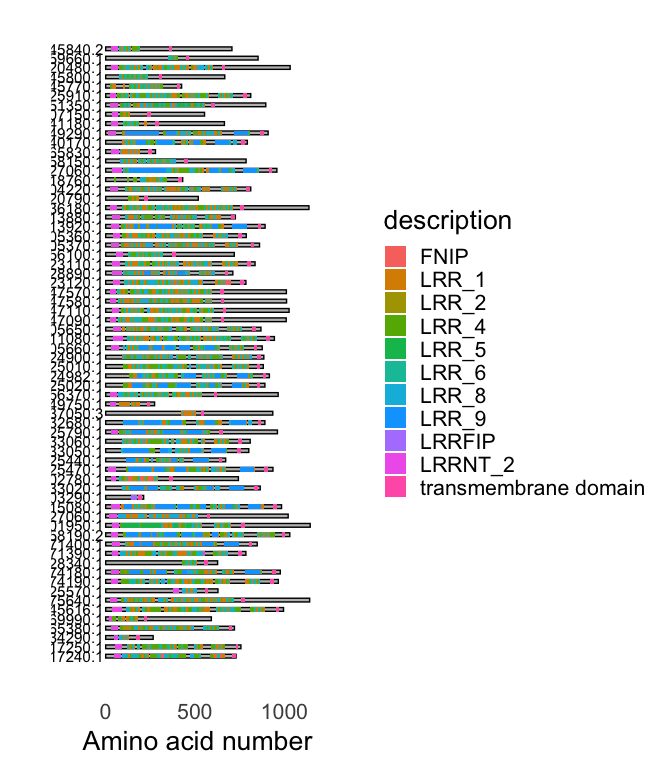

<!-- README.md is generated from README.Rmd. Please edit that file -->

# buscadoR

<!-- badges: start -->
<!-- badges: end -->


The goal of `buscadoR` is to find plant receptor proteins in information
from from hmmer, deeptmhmm and BLAST to find signal peptides, repeats,
transmembrane and ectodomains then applies a heuristic to classify into
receptor classes.

## Prerequisites

`buscadoR` requires input from `hmmer`, `deeptmhmm` and `BLAST`. A
Google Colab notebook is available to help you run these time consuming
searches easily. Go to the
[Notebook](https://colab.research.google.com/drive/1hKDLBCZQcB-wuaFjPGEyTFk0AV34AdON?usp=sharing)
to run searches before proceeding. If you wish to run these locally
please see the section Running `buscadoR` searches locally”.

This R package assumes that you have already performed those searches
and have the necessary files to hand.

## Installation

You can install buscadoR from [GitHub](https://github.com/) with:

``` r
# install.packages("devtools")
devtools::install_github("TeamMacLean/buscadoR")
```

## Compiling the results, classifying the proteins

The search results can be combined and the RLK classes predicted with
the `buscar` function. Pass in all the input files, including the
original FASTA file.

Note that you can pass either gzipped (`.gz`) files or plain text files.

``` r
library(buscadoR)

fasta_file <- "arabidopsis_proteome.fa"
hmmer_file <- "hmmer_results.txt.gz"
deeptmhmm_file <- "deeptmhmm_results.txt.gz"
blast_file <- "blast_results.txt.gz"

b <- buscar(hmmer = hmmer_file, deeptmhmm = deeptmhmm_file, blast = blast_file, fasta = fasta_file)
```

## Examining the results

A set of helper functions to help you extract data into a useable result
is provided.

A summary table of each type found can be generated

``` r
mesa(b)
```

| b_type              | count |
|:--------------------|------:|
| lrr_rk              |   196 |
| lrr_rp              |    66 |
| lrr_rp_rk_with_ecto |    50 |
| non_lrr_rk          |   201 |
| non_lrr_rp          |    64 |

BuscadoR RLK Finding results

A dataframe of one row per receptor protein found (ideal for exporting)
can be created

``` r
as.data.frame(b)
#> # A tibble: 577 × 10
#>    seq_name    sp_cut_site tm_start tm_end pfams_hit  pfams_acc pfams_loc b_type
#>    <chr>             <int>    <int>  <int> <chr>      <chr>     <chr>     <chr> 
#>  1 AT1G17240.1          44      708    728 LRR_8;LRR… PF13855.… 94-150;1… lrr_rp
#>  2 AT1G17250.1          50      726    738 LRR_8;LRR… PF13855.… 121-157;… lrr_rp
#>  3 AT1G25570.1          23      554    574 LRR_4;LRR… PF12799.… 443-460;… lrr_rp
#>  4 AT1G28340.1          22      550    570 LRR_8;LRR… PF13855.… 426-458;… lrr_rp
#>  5 AT1G34290.1          26      170    190 LRR_4;LRR… PF12799.… 94-130;7… lrr_rp
#>  6 AT1G45616.1          29      951    971 LRR_8;LRR… PF13855.… 117-157;… lrr_rp
#>  7 AT1G58190.2          27      985   1005 LRR_8;LRR… PF13855.… 123-162;… lrr_rp
#>  8 AT1G65380.1          25      687    707 LRR_8;LRR… PF13855.… 84-133;1… lrr_rp
#>  9 AT1G69990.1          18      214    234 LRR_8;LRR… PF13855.… 68-101;1… lrr_rp
#> 10 AT1G71390.1          25      740    760 LRR_8;LRR… PF13855.… 79-114;1… lrr_rp
#> # … with 567 more rows, and 2 more variables: ectos_hit <chr>,
#> #   ectos_coord <chr>
```

A tidy format dataframe of each type of receptor protein can be
extracted

``` r
lrr_rp(b)
#> # A tibble: 3,244 × 14
#>    seq_name cut_site tm_start tm_end hit   acc     eval seq_from seq_to hit_from
#>    <chr>       <int>    <int>  <int> <chr> <chr>  <dbl>    <dbl>  <dbl>    <int>
#>  1 AT1G172…       44      708    728 LRR_8 PF13… 2  e-7       94    150        5
#>  2 AT1G172…       44      708    728 LRR_8 PF13… 1.5e-6      115    181        2
#>  3 AT1G172…       44      708    728 LRR_8 PF13… 2.3e-2      171    233        3
#>  4 AT1G172…       44      708    728 LRR_8 PF13… 4.6e-6      246    305        2
#>  5 AT1G172…       44      708    728 LRR_8 PF13… 9.6e-5      315    353       23
#>  6 AT1G172…       44      708    728 LRR_8 PF13… 2.1e-6      362    402       21
#>  7 AT1G172…       44      708    728 LRR_8 PF13… 1.9e-1      406    450       16
#>  8 AT1G172…       44      708    728 LRR_8 PF13… 1  e-7      470    529        2
#>  9 AT1G172…       44      708    728 LRR_8 PF13… 7.5e-7      581    636        6
#> 10 AT1G172…       44      708    728 LRR_8 PF13… 2.9e-5      602    660        3
#> # … with 3,234 more rows, and 4 more variables: hit_to <int>, base_acc <chr>,
#> #   b_type <chr>, pfam_length <dbl>
```

also `lrr_rk()`, `non_lrr_rp()`, `non_lrr_rk()`, `lrr_rp_rk_with_ecto()`

Raw search results from the databases can be extracted

``` r
hmmer_results(b)
#> # A tibble: 22,890 × 11
#>    seq_name   hit   acc     eval seq_from seq_to hit_from hit_to base_acc b_type
#>    <chr>      <chr> <chr>  <dbl>    <dbl>  <dbl>    <int>  <int> <chr>    <chr> 
#>  1 AT1G17600… LRR_4 PF12… 1.5e-1      607    646        5     42 PF12799  LRR_P…
#>  2 AT1G17600… LRR_4 PF12… 8.7e-2      626    662        1     35 PF12799  LRR_P…
#>  3 AT1G17600… LRR_4 PF12… 4  e+0      649    679        1     26 PF12799  LRR_P…
#>  4 AT1G17600… LRR_4 PF12… 2.4e-4      798    835        3     42 PF12799  LRR_P…
#>  5 AT1G17600… LRR_4 PF12… 7.2e-4      843    883        2     43 PF12799  LRR_P…
#>  6 AT1G17600… LRR_4 PF12… 9.9e-3      893    931        3     42 PF12799  LRR_P…
#>  7 AT1G17600… LRR_4 PF12… 2.4e-3      915    958        1     42 PF12799  LRR_P…
#>  8 AT1G17600… LRR_3 PF07… 2.5e-8      604    622        1     19 PF07725  LRR_P…
#>  9 AT1G17600… LRR_8 PF13… 5.6e-3      605    659        3     59 PF13855  LRR_P…
#> 10 AT1G17600… LRR_8 PF13… 3.5e-6      797    852        2     59 PF13855  LRR_P…
#> # … with 22,880 more rows, and 1 more variable: pfam_length <dbl>
```

also `deeptmhmm_results()`, `ecto_results()`

Each set of putative proteins can be rendered as a plot

``` r
dibujar(b, which = "lrr_rp")
```



also use “lrr_rk”, “non_lrr_rp”, “non_lrr_rk”, “lrr_rp_rk_with_ecto”

## Exporting results

A dataframe of one row per receptor protein can be created and written
out in the usual way

``` r
res <- as.data.frame(b)
readr::write_csv(res, "my_results.csv")
```

Annotated FASTA sequences can be exported

``` r
write_seqs(b, "my_seqs.fa")
```

## Other Stuff

A dataframe compatible with the `drawProteins` package [here on
bioconductor](https://bioconductor.org/packages/release/bioc/vignettes/drawProteins/inst/doc/drawProteins_BiocStyle.html)
can be created for further plotting work. Note the plot is a `ggplot2`
object and can be styled using that package too.

``` r
dp <- as.drawProteins(b)
```

The definitions used for the classification can be returned

``` r
definiciones(which="lrr_rp")
#> lrr_rp =
#>      * A signal peptide according to Phobius.
#>      * Exactly one Transmembrane Domain according to Phobius.
#>      * At least one of the `lrr_pfams` according to PFAMscan.
#>      * The Transmembrane domain should be closer to the C terminal than the end of the pfam hit.
```

also use “lrr_rk”, “non_lrr_rp”, “non_lrr_rk”, “lrr_rp_rk_with_ecto”,
“all”

## Running `buscadoR` searches locally

If you wish to run the searches locally the output formats for each
program need to be set carefully to work with `buscar()`.

### `hmmer`

The PFAM domain hmms used for the `hmmer` search are provided here as a
file
[buscador_pfam_hmm](https://github.com/TeamMacLean/buscador_hlp/blob/main/buscador.hmm).
Alternatively you can parse the latest versions from the PFAM-A
database. The required IDs can be listed from `buscadoR` as they are
held in the data objects `lrr_pfam`, `non_lrr_pfam` and `kinase_pfams`.

When running `hmmscan` use `--domtblout` as the output option.

### `deeptmhmm`

There are no options for `deeptmhmm`. When running this locally, a
single output file is created for each sequence. Just concatenate these
into one file for input into `buscar()`

### `blastp`

The ecto-domains for use as query sequence in the `blastp` are available
here as a fasta
[buscador_ecto_fasta](https://github.com/TeamMacLean/buscador_hlp/blob/main/At_ecto.fa)

Use `blastp` with these as the query and the proteins of interest as the
subject, select `outfmt 6`. The resulting text file can be used as input
to `buscar()`
