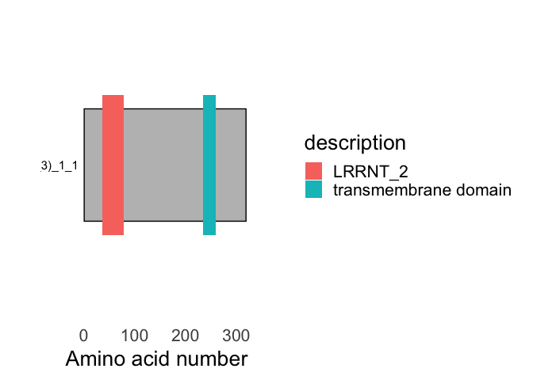

<!-- README.md is generated from README.Rmd. Please edit that file -->

# buscadoR

<!-- badges: start -->

[](https://github.com/TeamMacLean/buscadoR/actions)
<!-- badges: end -->

The goal of buscadoR is to find plant receptor proteins from provided
FASTA sequence. It uses the web API of PFAM and phobius and a local
BLAST to find repeat, transmembrane and ecto- domains, signal peptides
then applies a heuristic to classify into receptor classes.

## Installation

You can install the development version of buscadoR from
[GitHub](https://github.com/) with:

``` r
# install.packages("devtools")
devtools::install_github("TeamMacLean/buscadoR")
```

## Performing the web search

Use the `buscar` function to perform the searches, the only two required
parameters are the FASTA file path and a valid email address that you
have access to.

``` r
library(buscadoR)
file_path <- "true_positive.fa"
searches <- buscar(file_path, email="my_name@my.org")
#> Warning in split_fasta(path_in = file_name, path_out = tmp_phob, num_seq = 500): Sequence names contain special characters, this can cause
#>                 problems in downstream functions.
#> Warning in split_fasta(path_in = file_name, path_out = tmppfam, num_seq = 100): Sequence names contain special characters, this can cause
#>                 problems in downstream functions.
```

If you want a progress bar in an interactive session

``` r
searches <- buscar(file_path, email="my_name@my.org", progress=TRUE)
```

## Examining the results

A summary table of each type found can be generated

``` r
mesa(searches)
```

| b\_type      | count |
|:-------------|------:|
| lrr\_rk      |     2 |
| lrr\_rp      |     1 |
| non\_lrr\_rp |     1 |

BuscadoR RLK Finding results

A dataframe of one row per protein (ideal for exporting) can be created

``` r
as.data.frame(searches)
#> # A tibble: 4 × 10
#>   Name          sp_cut_site tm_start tm_end pfams_hit pfams_acc pfams_loc b_type
#>   <chr>         <chr>          <dbl>  <dbl> <chr>     <chr>     <chr>     <chr> 
#> 1 transcript_1… 29               235    259 LRRNT_2   PF08263.… 36-79     lrr_rp
#> 2 transcript_1… 35               591    611 LRRNT_2;… PF08263.… 34-74;15… lrr_rk
#> 3 transcript_1… 39               644    667 LRR_8;Pk… PF13855.… 324-381;… lrr_rk
#> 4 transcript_1… 16               262    285 Malectin  PF11721.8 60-245    non_l…
#> # … with 2 more variables: ectos_hit <chr>, ectos_coord <chr>
```

Tidy format dataframe of each type of receptor protein can be extracted

``` r
lrr_rp(searches)
#>                                      Name cut_site tm_start tm_end     hit
#> 1 transcript_102826_-_ORF_1_(frame_3)_1_1       29      235    259 LRRNT_2
#>          acc    eval   type seq_from seq_to hit_from hit_to base_acc   b_type
#> 1 PF08263.12 0.00072 Family       36     79        2     41  PF08263 LRR_PFAM
#>   pfam_length
#> 1          43
#also lrr_rk(), non_lrr_rp(), non_lrr_rk(), lrr_rp_rk_with_ecto()
```

Raw search results from the databases can be extracted

``` r
pfam_results(searches)
#>                                   seq_name         hit        acc    eval
#> 1  transcript_103865_-_ORF_1_(frame_3)_1_1     LRRNT_2 PF08263.12 3.1e-11
#> 2  transcript_103865_-_ORF_1_(frame_3)_1_1       LRR_8  PF13855.6 2.2e-06
#> 3  transcript_103865_-_ORF_1_(frame_3)_1_1       LRR_8  PF13855.6 9.0e-07
#> 4  transcript_103865_-_ORF_1_(frame_3)_1_1       LRR_8  PF13855.6 3.0e-09
#> 5  transcript_103865_-_ORF_1_(frame_3)_1_1     Pkinase PF00069.25 3.4e-45
#> 6  transcript_102826_-_ORF_1_(frame_3)_1_1     LRRNT_2 PF08263.12 7.2e-04
#> 7  transcript_115185_-_ORF_1_(frame_2)_1_1     Pkinase PF00069.25 9.3e-47
#> 8  transcript_103278_-_ORF_1_(frame_3)_1_1    Malectin  PF11721.8 4.1e-40
#> 9    transcript_121308_-_ORF_1_(frame_1)_1 Pkinase_Tyr PF07714.17 9.0e-48
#> 10   transcript_130761_-_ORF_1_(frame_2)_1       LRR_8  PF13855.6 2.7e-06
#> 11   transcript_130761_-_ORF_1_(frame_2)_1    Malectin  PF11721.8 1.2e-42
#> 12   transcript_130761_-_ORF_1_(frame_2)_1     Pkinase PF00069.25 2.8e-46
#>      type seq_from seq_to hit_from hit_to base_acc       b_type pfam_length
#> 1  Family       34     74        2     41  PF08263     LRR_PFAM          40
#> 2  Repeat      151    210        2     61  PF13855     LRR_PFAM          59
#> 3  Repeat      271    329        3     61  PF13855     LRR_PFAM          58
#> 4  Repeat      389    449        1     61  PF13855     LRR_PFAM          60
#> 5  Domain      662    917        5    259  PF00069  KINASE_PFAM         255
#> 6  Family       36     79        2     41  PF08263     LRR_PFAM          43
#> 7  Domain      328    596        2    259  PF00069  KINASE_PFAM         268
#> 8  Domain       60    245        3    165  PF11721 NON_LRR_PFAM         185
#> 9  Domain      691    960        4    258  PF07714  KINASE_PFAM         269
#> 10 Repeat      324    381        2     61  PF13855     LRR_PFAM          57
#> 11 Domain      435    620        2    165  PF11721 NON_LRR_PFAM         185
#> 12 Domain      705    965        3    256  PF00069  KINASE_PFAM         260
#also phobius_results(), ecto_results()
```

Each set of found proteins can be rendered as a plot

``` r
dibujar(searches, which = "lrr_rp")
```



``` r
#also use "lrr_rk", "non_lrr_rp", "non_lrr_rk", "lrr_rp_rk_with_ecto"
```

## Exporting results

A dataframe of one row per protein can be created and written out in the
usual way

``` r
res <- as.data.frame(searches)
readr::write_csv(res, "my_results.csv")
```

Annotated FASTA sequences can be exported

``` r
write_seqs(searches, "my_seqs.fa")
```

## Other

A dataframe compatible with the `drawProteins` package [here on
bioconductor](https://bioconductor.org/packages/release/bioc/vignettes/drawProteins/inst/doc/drawProteins_BiocStyle.html)
can be created for further plotting work.

``` r
dp <- as.drawProteins(searches)
```

Note the plot is a `ggplot2` object and can be styled using that package
too.

The definitions used for the classification can be returned

``` r
definiciones(which="lrr_rp")
#> lrr_rp =
#>      * A signal peptide according to Phobius.
#>      * Exactly one Transmembrane Domain according to Phobius.
#>      * At least one of the `lrr_pfams` according to PFAMscan.
#>      * The Transmembrane domain should be closer to the C terminal than the end of the pfam hit.
#also use "lrr_rk", "non_lrr_rp", "non_lrr_rk", "lrr_rp_rk_with_ecto", "all"
```
