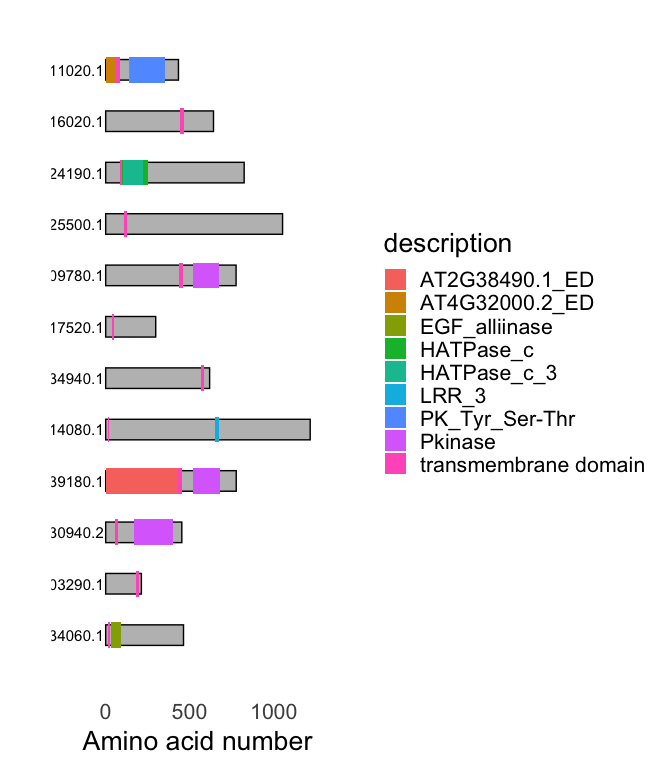

<!-- README.md is generated from README.Rmd. Please edit that file -->

# buscadoR

<!-- badges: start -->
<!-- badges: end -->


The goal of `buscadoR` is to find plant receptor proteins in information
from from hmmer, deeptmhmm and BLAST to find signal peptides, repeats,
transmembrane and ectodomains then applies a heuristic to classify into
receptor classes.

## Prerequisites

`buscadoR` requires input from `hmmer`, `deeptmhmm` and `BLAST`. A
Google Colab notebook is available to help you run these time consuming
searches easily. Go to the
[Notebook](https://colab.research.google.com/drive/1hKDLBCZQcB-wuaFjPGEyTFk0AV34AdON?usp=sharing)
to run searches before proceeding. If you wish to run these locally
please see the section Running `buscadoR` searches locally”.

This R package assumes that you have already performed those searches
and have the necessary files to hand.

## Installation

You can install buscadoR from [GitHub](https://github.com/) with:

``` r
# install.packages("devtools")
devtools::install_github("TeamMacLean/buscadoR")
```

## Compiling the results, classifying the proteins

The search results can be combined and the RLK classes predicted with
the `buscar` function. Pass in all the input files, including the
original FASTA file.

Note that you can pass either gzipped (`.gz`) files or plain text files.

``` r
library(buscadoR)

fasta_file <- "arabidopsis_proteome.fa"
hmmer_file <- "hmmer_results.txt.gz"
deeptmhmm_file <- "deeptmhmm_results.txt.gz"
blast_file <- "blast_results.txt.gz"

b <- buscar(hmmer = hmmer_file, deeptmhmm = deeptmhmm_file, blast = blast_file, fasta = fasta_file)
```

## Examining the results

A set of helper functions to help you extract data into a useable result
is provided.

A summary table of each type found can be generated

``` r
mesa(b)
```

| group           |   n |
|:----------------|----:|
| LRR-RK          | 111 |
| LRR-RP          |  44 |
| LRR+OTHER-RK    |  83 |
| LRR+OTHER-RP    |  23 |
| OTHER-RK        | 145 |
| OTHER-RP        |  59 |
| TM-KINASE       |  11 |
| TM-PROTEIN      |  12 |
| unclassified_RK |  12 |
| unclassified_RP |   3 |

BuscadoR RLK Finding results

A tibble (dataframe) of one row per receptor protein found (ideal for
exporting) can be created

``` r
to_tibble(b)
#> # A tibble: 503 × 11
#>    seq_name    group       evidence cut_site tm_start tm_end pfams_hit pfams_acc
#>    <chr>       <chr>       <chr>       <int>    <int>  <int> <chr>     <chr>    
#>  1 AT1G49730.1 unclassifi… t1             55      285    305 Pkinase;… PF00069.…
#>  2 AT1G65800.1 LRR+OTHER-… t7             27      440    460 PK_Tyr_S… PF07714.…
#>  3 AT1G65790.1 OTHER-RK    PFAM           27      436    456 PK_Tyr_S… PF07714.…
#>  4 AT1G55610.1 LRR-RK      PFAM+BL…       24      777    797 LRR_8;LR… PF13855.…
#>  5 AT1G10850.1 LRR-RK      PFAM+BL…       32      259    279 Pkinase;… PF00069.…
#>  6 AT1G70530.1 OTHER-RK    PFAM+BL…       20      261    281 PK_Tyr_S… PF07714.…
#>  7 AT1G70520.1 OTHER-RK    PFAM+BL…       29      261    281 Pkinase;… PF00069.…
#>  8 AT1G16260.1 OTHER-RK    PFAM+BL…       23      316    336 PK_Tyr_S… PF07714.…
#>  9 AT1G17240.1 LRR-RP      PFAM+BL…       44      708    728 LRR_8;LR… PF13855.…
#> 10 AT1G17230.1 LRR+OTHER-… t6             23      735    755 Pkinase;… PF00069.…
#> # … with 493 more rows, and 3 more variables: pfams_loc <chr>, blast_hit <chr>,
#> #   blast_loc <chr>
```

Raw search results from the databases can be extracted

``` r
pfam_results(b)
#> # A tibble: 4,831 × 11
#>    seq_name  hit   acc      eval seq_from seq_to hit_from hit_to base_acc b_type
#>    <chr>     <chr> <chr>   <dbl>    <dbl>  <dbl>    <int>  <int> <chr>    <chr> 
#>  1 AT1G1760… LRR_3 PF07… 2.5e- 8      604    622        1     19 PF07725  LRR_P…
#>  2 AT1G1268… Pkin… PF00… 7.1e-72      107    355        1    264 PF00069  KINAS…
#>  3 AT1G1268… PK_T… PF07… 2.7e-36      109    348        3    254 PF07714  KINAS…
#>  4 AT1G1268… Kina… PF14… 1  e- 9      209    343      154    288 PF14531  KINAS…
#>  5 AT1G1268… ABC1  PF03… 2.6e- 7      173    251      142    219 PF03109  KINAS…
#>  6 AT1G7345… Pkin… PF00… 1.3e-51      841   1143        1    264 PF00069  KINAS…
#>  7 AT1G7345… PK_T… PF07… 2.7e-19      843   1051        3    212 PF07714  KINAS…
#>  8 AT1G0944… Pkin… PF00… 3.7e-50      158    426        2    260 PF00069  KINAS…
#>  9 AT1G0944… PK_T… PF07… 6.3e-48      159    428        3    259 PF07714  KINAS…
#> 10 AT1G7346… Pkin… PF00… 1.4e-51      858   1160        1    264 PF00069  KINAS…
#> # … with 4,821 more rows, and 1 more variable: pfam_length <dbl>
```

also `deeptmhmm_results()`, `blast_results()`

Each set of putative proteins can be rendered as a plot

``` r
dibujar(b, which = "TM-PROTEIN")
```



also use
`LRR-RK, LRR-RP, LRR+OTHER-RK, LRR+OTHER-RP, OTHER-RK, OTHER-RP, TM-KINASE, TM-PROTEIN, unclassified_RK, unclassified_RP`

## Exporting results

A tibble (dataframe) of one row per receptor protein can be created and
written out

``` r
res <- to_tibble(b)
readr::write_csv(res, "my_results.csv")
```

Annotated FASTA sequences can be exported

``` r
write_seqs(b, "my_seqs.fa")
```

## Other Stuff

A dataframe compatible with the `drawProteins` package [here on
bioconductor](https://bioconductor.org/packages/release/bioc/vignettes/drawProteins/inst/doc/drawProteins_BiocStyle.html)
can be created for further plotting work. Note the plot is a `ggplot2`
object and can be styled using that package too.

``` r
dp <- as_drawProteins(b)
```

The definitions used for the classification can be returned

``` r
definiciones()
#> # A tibble: 64 × 10
#>    group    evidence   SP    TM    kinase_pfam lrr_pfam other_pfam at_lrr_blast
#>    <chr>    <chr>      <lgl> <lgl> <lgl>       <lgl>    <lgl>      <lgl>       
#>  1 LRR-RK   PFAM       TRUE  TRUE  TRUE        TRUE     FALSE      FALSE       
#>  2 LRR-RK   BLAST      TRUE  TRUE  TRUE        FALSE    FALSE      TRUE        
#>  3 LRR-RK   PFAM+BLAST TRUE  TRUE  TRUE        TRUE     FALSE      TRUE        
#>  4 LRR-RP   PFAM       TRUE  TRUE  FALSE       TRUE     FALSE      FALSE       
#>  5 LRR-RP   BLAST      TRUE  TRUE  FALSE       FALSE    FALSE      TRUE        
#>  6 LRR-RP   PFAM+BLAST TRUE  TRUE  FALSE       TRUE     FALSE      TRUE        
#>  7 OTHER-RK PFAM       TRUE  TRUE  TRUE        FALSE    TRUE       FALSE       
#>  8 OTHER-RK BLAST      TRUE  TRUE  TRUE        FALSE    FALSE      FALSE       
#>  9 OTHER-RK PFAM+BLAST TRUE  TRUE  TRUE        FALSE    TRUE       FALSE       
#> 10 OTHER-RP PFAM       TRUE  TRUE  FALSE       FALSE    TRUE       FALSE       
#> # … with 54 more rows, and 2 more variables: at_other_blast <lgl>,
#> #   at_unspec_blast <lgl>
```

## Running `buscadoR` searches locally

If you wish to run the searches locally the output formats for each
program need to be set carefully to work with `buscar()`.

### `hmmer`

The PFAM domain hmms used for the `hmmer` search are provided here as a
file
[buscador_pfam_hmm](https://github.com/TeamMacLean/buscador_hlp/blob/main/buscador.hmm).
Alternatively you can parse the latest versions from the PFAM-A
database. The required IDs can be listed from `buscadoR` as they are
held in the data objects `lrr_pfam`, `non_lrr_pfam` and `kinase_pfams`.

When running `hmmscan` use `--domtblout` as the output option.

### `deeptmhmm`

There are no options for `deeptmhmm`. When running this locally, a
single output file is created for each sequence. Just concatenate these
into one file for input into `buscar()`

### `blastp`

The ecto-domains for use as query sequence in the `blastp` are available
here as a fasta
[buscador_ecto_fasta](https://github.com/TeamMacLean/buscador_hlp/blob/main/At_ecto.fa)

Use `blastp` with these as the query and the proteins of interest as the
subject, select `outfmt 6`. The resulting text file can be used as input
to `buscar()`
